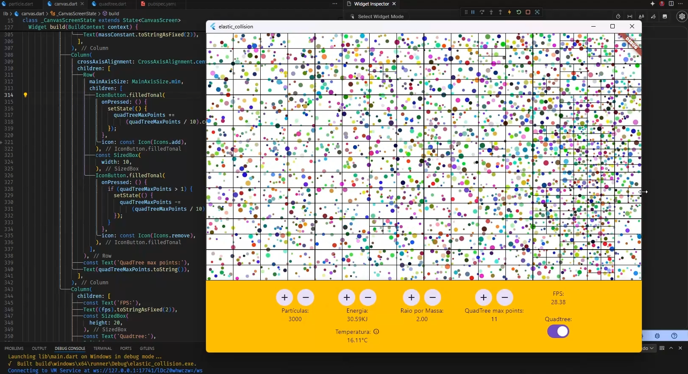

# elastic_collision

Um projeto de estudo que consite em implementar:

- Sistema de detecção de colisão
- Colisão elástica
- Quadtree

## O projeto

Se trata de um simulador de particulas que colidirão com as bordas da tela e entre si utilizando a fórmula da Colisão Elástica 2D, com isso mantendo a energia cinética dos sistema somente com transfêrencia da energia entre as partículas.
Para isso foi utilizado o framework Flutter com uma única biblioteca, a [vector_math](https://pub.dev/packages/vector_math) , para facilitar os cálculos entre diferentes vetores.
Foi criado uma classe para representar as [partículas](./lib/particle.dart) onde cada partícula possui um método de update e outro de calcular a colisão com outra partícula.
O update da partícula é um simples cálculo de velocidade newtoniana, contudo o cálculo para a colisão elástica foi utilizado a [fórmula básica](https://en.wikipedia.org/wiki/Elastic_collision) com muita ajuda do professor [Dan Shiffman](https://www.youtube.com/watch?v=dJNFPv9Mj-Y).
A tela é atualizada a cada frame gerado pelo Flutter aplicando os métodos de update e de colisão entre as partículas.
Para aprimorar a eficiência foi implementada uma classe [Quadtree](.lib/quadtree.dart) com base na [documentação](https://en.wikipedia.org/wiki/Elastic_collision).

## Conclusão

A formula da colisão elástica se mostrou um grande desafio, sendo resolvido somente com ajuda do professor Dan Shiffman e mesmo assim existe uma variação pequena na quantidade de energia do sistema devido aos arredondamentos do dart.
A difernça de performance de aplicação do quadtree para armazenar os posicionamentos das partículas e ser percorrido para aplicar as colisões entre partículas foi excencial acima de 3000 partículas, saltando de 8fps para 40fps com a aplicação rodando em modo desktop windows.
Também foi aplicado um conjunto ao estilho hash para evitar a duplicidade de cálculo entre as partículas.

[Exemplo](https://elasticcollision.web.app/)

