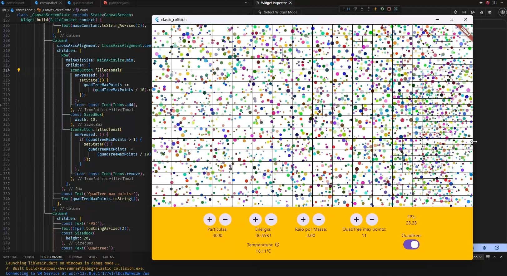

# elastic_collision

A study project that consists of implementing:

- Collision detection system
- Elastic collision
- Quadtree

## The project

This is a particle simulator where particles will collide with the screen edges and with each other using the 2D Elastic Collision formula, thereby maintaining the kinetic energy of the system only through energy transfer between the particles.
For this, the Flutter framework was used with a single library, [vector_math](https://pub.dev/packages/vector_math), to facilitate calculations between different vectors.
A class was created to represent the [particles](./lib/particle.dart) where each particle has an update method and another to calculate collision with another particle.
The particle update is a simple Newtonian velocity calculation; however, for the elastic collision calculation, the [basic formula](https://en.wikipedia.org/wiki/Elastic_collision) was used with a lot of help from Professor [Dan Shiffman](https://www.youtube.com/watch?v=dJNFPv9Mj-Y).
The screen is updated with each frame generated by Flutter, applying the update and collision methods between the particles.
To enhance efficiency, a [Quadtree](.lib/quadtree.dart) class was implemented based on the [documentation](https://en.wikipedia.org/wiki/Quadtree).

## Conclusion

The elastic collision formula proved to be a significant challenge, being resolved only with the help of Professor Dan Shiffman, and even so, there is a small variation in the system's energy due to dart rounding.
The difference in performance in applying the quadtree to store particle positions and iterate over them to apply collisions was essential for over 3000 particles, jumping from 8fps to 40fps.
A hash-style set was also applied to avoid duplicate calculations between particles.

[Sample](https://elasticcollision.web.app/)

